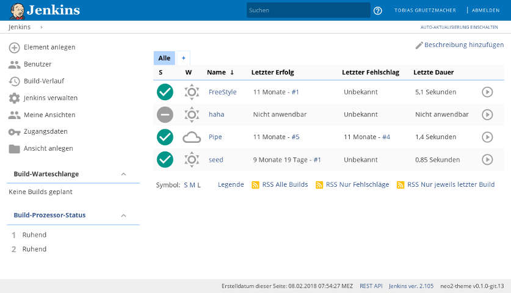
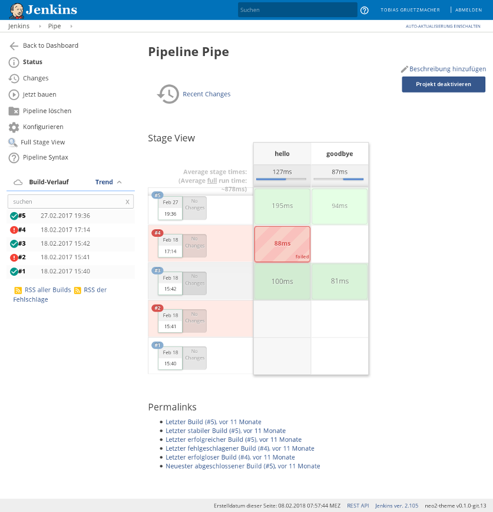

# Mr Jenkins Theme

Beautify your Jenkins with the modern flat theme!

## Screenshots

## Installation

If you want to keep using an older release, replace `/dist/` in all URLs with
an older version, for example `/v0.2.0/`.

### Using this GitHub page

1. Install [Jenkins Simple Theme Plugin][simple]

2. Click `Manage Jenkins`

3. Click `Configure System` and scroll down to `Theme`

4. Specify the URL for `https://<dominio>/mr-jenkins-theme/dist/MrTheme.css`.

5. Click `Save`

### Using your Jenkins Hosting

1. Copy the file
   `MrTheme.css` to the
   directory `userContent` in your `JENKINS_HOME`

2. Follow the steps of the previous method and use `/userContent/MrTheme.css`
   as the URL.

## Development

CSS file are minified and compressed with Grunt. If you have [_node_][n] & [_yarn
installed_][y], you can build everything with:

`yarn test`

This will generate the following file:

- dist/neo-light.css

If you are experiencing issues please let me know! Also, feel free to contribute!

## Thanks to

- [Jenkins neo theme][neo] for the inspiration and original work
- [Jenkins material theme][material] for the inspiration and original work
- [Simple Theme Plugin][simple] for the Simple Theme plugin
- [Google][google] for the material design inspiration and the icons
- [Material Design Icons][material-design-icons] for some extra icons

[neo]: https://github.com/jenkins-contrib-themes/jenkins-neo-theme
[material]: https://github.com/afonsof/jenkins-material-theme
[simple]: https://plugins.jenkins.io/simple-theme-plugin
[google]: https://www.google.com/design/spec/material-design/introduction.html
[material-design-icons]: https://materialdesignicons.com/
[n]: http://npm_i
[y]: http://npm_i_--global_yarn

